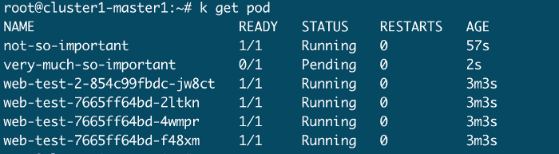
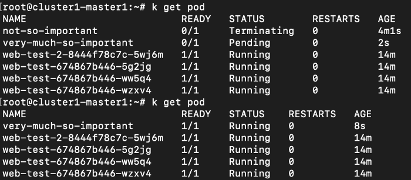

1. [Multi Container Issue](##1-Multi-Container-Issue)
2. [Scheduler Playground](##2-Scheduler-Playground)
3. [Advanced Scheduling](##3-Advanced-Scheduling)
4. [Node Management](##4-Node-Management)
5. [Manage Certificates](##5-Manage-Certificates)
6. [Pod Priority](##6-Pod-Priority)
7. [RBAC](##7-RBAC)
8. coming up…

# Scenario Setup
You will start a two node cluster on your machine, one master and one worker. For this you need to install VirtualBox and vagrant, then:

```bash
git clone git@github.com:wuestkamp/cka-example-environments.git
cd cka-example-environments/cluster1
./up.sh

vagrant ssh cluster1-master1
vagrant@cluster1-master1:~$ sudo -i
root@cluster1-master1:~# kubectl get node
```

You should be connected as `root@cluster1-master1`. You can connect to other worker nodes using root, like `ssh root@cluster1-worker1`

If you want to destroy the environment again run `./down.sh`. **You should destroy the environment after usage so no more resources are used!**

---

## 1-Multi Container Issue
### Todays Task: Investigate Multi container Pod issue

1. Get the amount of nodes plus their status and all available kubectl contexts.
2. In namespace management there is a pod named web-server, check its status.
3. Find the reason / error in the pod logs.
4. Directly gather the logs of the docker containers and check for issues.
5. Fix the pod and ensure its running.

### Solution
<details>
The following commands will be executed as `root@cluster1-master1`:

```bash
alias k=kubectl
```

1. We are connected to a new cluster, so first we get an overview:

```bash
k get node # should show one master and one worker
k config get-contexts # only one context
```

2.

```bash
k -n management get pod # there are other resources
k -n management get pod web-server # shows ERROR
k -n management describe pod web-server # doesn't show much
```

3.

```bash
k -n management logs web-server -c nginx # nothing
k -n management logs web-server -c httpd
```

The logs from the httpd container show:

```bash
(98)Address in use: AH00072: make_sock: could not bind to address 0.0.0.0:80
```

The error is that both container try to bind port 80 and in a pod, all containers share the same linux kernel network namespace, hence this is not possible.

4.

For this we need to check where the pod is scheduled:

```bash
k -n management get pod web-server -o wide
```

Its schedule on cluster1-worker1 , so we ssh into it:

```bash
ssh root@cluster1-worker1
root@cluster1-worker1:~# docker ps | grep web-server
```

This lists the pause container which is always created for a pod and the nginx container.

```bash
# use the nginx container ID
root@cluster1-worker1:~# docker logs e212e6b1788f
```

This shows the same empty response as using `k -n management logs web-server -c nginx`.

The httpd could not be created hence we cannot gather logs. But we can check docker events:

```bash
docker events --until 0m | grep web-server
docker events --until 0m | grep web-server | grep die
```

This shows us some information about the container creation and deletion.

5.

Well, this was a bit of a broad request :) First of all there should probably never be nginx+httpd in one pod, as both do the same thing as they are webserver.

We could try to run one of the containers on a different port but this would require to add and alter the default configuration.

### Clean up
**Run**: `./down.sh`

</details>

---

## 2-Scheduler Playground
### Todays Task: Investigate Multi container Pod issue
1. How many pods and services are in namespace management? Create a command that uses jsonpath to output the number.
2. How many schedulers are running? Find the parameters each is started with.
3. There is an existing deployment named `what-a-deployment` in namespace `development` . With which scheduler are the pods of that deployment scheduled?
4. Create a pod of image `nginx:1.16.1-alpine` in namespace `development` using the scheduler `kube-scheduler-amazing` and check its running + which node it got assigned.
5. Create another pod of image `nginx:1.16.1-alpine` in namespace `development` using the scheduler `kube-scheduler-none-existing`. What status does the pod have and what do the logs show?

### Solution
<details>
The following commands will be executed as `root@cluster1-master1`:

```bash
alias k=kubectl
```

1.

```bash
k -n management get pod,svc # we can manually count
```

But to do some jsonpath magic:

```bash
k -n management get pod,svc -o jsonpath="{range .items[*]}{.metadata.name}{'\n'}" | wc -l
```

we see 13 pods and services.

2.

```bash
k -n kube-system get pod | grep scheduler
```

We see two pods, `kube-scheduler-amazing-cluster1-master1` and `kube-scheduler-cluster1-master1`. On the suffix we can see that these are static pods, hence:

```bash
/etc/kubernetes/manifests/kube-scheduler-amazing.yaml
/etc/kubernetes/manifests/kube-scheduler.yaml
```

These files contain the requested parameters for the schedulers. Notice that this is the default manifests directory for a kubelet to look for static pods, this can be changed by passing a parameter to the kubelet.

3.

```bash
k -n development get deploy what-a-deployment -o yaml
k -n development get deploy what-a-deployment -o yaml | grep scheduler
```

=> default-scheduler

4.

```bash
k run pod --image=nginx:1.16.1-alpine --dry-run=client -o yaml > pod.yaml
vim pod.yaml
```

Change the yaml to:

```yaml
apiVersion: v1
kind: Pod
metadata:
  creationTimestamp: null
  labels:
    run: pod
  name: pod
  namespace: development # here
spec:
  schedulerName: kube-scheduler-amazing # and here
  containers:
  - image: nginx:1.16.1-alpine
    name: pod
    resources: {}
  dnsPolicy: ClusterFirst
  restartPolicy: Always
status: {}
```

Then create and check the assigned node:

```bash
k -f pod.yaml create
k -n development get pod -o wide # show assigned node
k -n development get pod pod -o yaml | grep scheduler
```

=> kube-scheduler-amazing

Great, the scheduler works.

5.

```bash
k run pod2 --image=nginx:1.16.1-alpine --dry-run=client -o yaml > pod2.yaml
```

Alter the yaml to use `kube-scheduler-none-existing` and and correct namespace. Then run it and the check the status and logs:

```bash
k -f pod2.yaml create
k -n development get pod pod2 -o wide # no node assigned
k -n development describe pod pod2
```

Logs are not available because the container didn’t even get started. Describe actually shows nothing regarding the missing scheduler. If we find a PENDING pod and have to investigate we would need to dive into the yaml.

### Clean up

**Run**: `./down.sh`

</details>

---

## 3-Advanced Scheduling
### Todays Task: Advanced Scheduling

1. How many pods of deployment coredns are running on which nodes.
2. Why are `coredns` pods running the nodes they are?
3. Show the config of `coredns` . The actual Corefile not the k8s yaml.
4. Create a deployment of image `httpd:2.4.41-alpine` with 3 replicas which can run on all nodes. How many are running on each node?
5. Now change the pods to only run on master nodes

### Solution
<details>
The following commands will be executed as `root@cluster1-master1`:

```bash
alias k=kubectl
```

1.

```bash
k get pod --all-namespaces | grep coredns # two pods
k get pod --all-namespaces -o wide | grep coredns # both on master
```

Next we check how these pods are created:

```bash
k -n kube-system get all | grep coredns # deployment!
```

So we have two pods because of the amount of replicas defined in the deployment.

2.

But why are both running on the master node, and only the master?

```bash
k -n kube-system get pod coredns-5644d7b6d9-4hp5t -o yaml | grep tolerations -A 20
```

Here we see the pods have a toleration to run on master, but this only means that they **can** run on a master node. There is no node selector or something else set to control that they **have to** run on a master node.

The reason here is simply that during cluster creation the `coredns` deployment was created before the worker node was ready. You can delete pod:

```bash
k -n kube-system delete pod coredns-5644d7b6d9-4hp5t coredns-5644d7b6d9-fswhw
```

which should result in one on the master and one on the worker node.

3.

It uses a configmap to manage the config:

```bash
k -n kube-system get cm coredns -o yaml
```

4.

```bash
k create deploy deploy --image=httpd:2.4.41-alpine -o yaml --dry-run=client > deploy.yaml
vim deploy.yaml
```

Add the master toleration:

```yaml
apiVersion: apps/v1
kind: Deployment
metadata:
  creationTimestamp: null
  labels:
    app: deploy
  name: deploy
spec:
  replicas: 3 # here
  selector:
    matchLabels:
      app: deploy
  strategy: {}
  template:
    metadata:
      creationTimestamp: null
      labels:
        app: deploy
    spec:
      containers:
      - image: httpd:2.4.41-alpine
        name: httpd
        resources: {}
      tolerations: # also here
      - effect: NoSchedule # also here
        key: node-role.kubernetes.io/master # also here
status: {}
```

Then run:

```bash
k -f deploy.yaml create
k get pod -l app=deploy -o wide
```

In my case: 2 on master and 1 on worker node. If no pod get’s scheduled on the worker you could set the `.spec.template.spec.nodeName` to `cluster1-worker1` to see that a pod can still run on a worker.

5.

Alter the yaml to:

```yaml
apiVersion: apps/v1
kind: Deployment
metadata:
  creationTimestamp: null
  labels:
    app: deploy
  name: deploy
spec:
  replicas: 3
  selector:
    matchLabels:
      app: deploy
  strategy: {}
  template:
    metadata:
      creationTimestamp: null
      labels:
        app: deploy
    spec:
      containers:
      - image: httpd:2.4.41-alpine
        name: httpd
        resources: {}
      tolerations:
      - effect: NoSchedule
        key: node-role.kubernetes.io/master
      nodeSelector: # here
        node-role.kubernetes.io/master: "" # here
status: {}
```

Now all 3 are running on the master node.

### Clean up

**Run**: `./down.sh`

</details>

---

## 4-Node Management
### Todays Task: Node Management

1. Drain the node `cluster1-worker1`. Save single pods manually to restore afterwards.
2. Remove the node `cluster1-worker1` temporarily from the cluster.
3. Add the worker node back to the cluster and allow scheduling again. Restore the single pods.
4. Create a pod of image `httpd:2.4.41-alpine` and confirm its scheduled on `cluster1-worker1`.
5. Expose the pod via a NodePort service and connect to it using curl. You should be able to connect to the internal IP of `cluster1-worker1` from your local machine.
6. Suspend the master node (`vagrant suspend cluster1-master1`), then check: is the pod still reachable via the NodePort service?
7. Resume the master node (`vagrant resume cluster1-master1`) and confirm node status normal.

### Solution
<details>

The following commands will be executed as `root@cluster1-master1`:

```bash
alias k=kubectl
```

1.

```bash
k get node # one master one worker
k drain cluster1-worker1
```

An error is displayed. **BUT** the node is now already marked as SchedulingDisabled so new pods couldn’t get scheduled!

We can use `--ignore-daemonsets` to kill pods of DaemonSets, but there are two pods not controlled by controller resources:

```bash
error: cannot delete Pods not managed by ReplicationController, ReplicaSet, Job, DaemonSet or StatefulSet (use --force to override): management/important-pod, management/web-server
```

So we export those:

```bash
k -n management get pod important-pod -o yaml --export > important-pod.yaml
k -n management get pod web-server -o yaml --export > web-server.yaml
```

I know the --export flag has been marked deprecated, but I don’t see a good alternative as of now. Else we need to clean the yaml configs ourselves.

And run:

```bash
k drain cluster1-worker1 --ignore-daemonsets --force
k get pod --all-namespaces # various PENDING states
```

2.

To remove the worker node stop the kubelet :

```bash
ssh cluster1-worker1
root@cluster1-worker1:~# service kubelet stop
root@cluster1-worker1:~# exit
```

Then we check the node status, **give it a minute or two**:

```bash
k get node
```

We should see cluster1-worker1 marked as NotReady,SchedulingDisabled.

3.

We add the node back to the cluster:

```bash
ssh cluster1-worker1
root@cluster1-worker1:~# service kubelet start
root@cluster1-worker1:~# exit
```

Then we check back:

```bash
k get node # should show Ready,SchedulingDisabled
k uncordon cluster1-worker1
k get node # back to normal
```

Restore the single pods:

```bash
k -n management -f important-pod.yaml create
k -n management -f web-server.yaml create
k get pod --all-namespaces -o wide
```

This should show all pods are RUNNING again. The pod `web-server` might still be in an ERROR state, this was handled in [part 1](##Multi-Container-Issue).

4.

```bash
k run pod --image=httpd:2.4.41-alpine
k get pod pod -o wide
```

Working, scheduled on cluster1-worker1 .

5.

```bash
k expose -h
k expose pod pod -h
k expose pod pod --port 80 --type=NodePort
k get svc pod # find node port
k get node -o wide # find node internal IP
```

And connect from your main machine:

```plain
➜ curl 192.168.101.201:30801
<html><body><h1>It works!</h1></body></html>
```

Awesome. Check my explanation of NodePort and the other Kubernetes Services if you need a refresh.

6.

Log out and run from your main machine:

```bash
➜ vagrant suspend cluster1-master1
```

`vagrant suspend` saves the current state of the virtual machine on disk, no more ram used.

Then check the NodePort service again:

```plain
➜ curl 192.168.101.201:30801
<html><body><h1>It works!</h1></body></html>
```

Still working!

That’s one great thing about Kubernetes, the current state is implemented on all worker nodes. Like the services are implemented via the kube-proxy which runs on all workers. If the master (or all masters) are down, like during an upgrade, the cluster still runs normally.

**BUT** controllers are running on master nodes which means resources like Deployment or HorizontalPodAutoscalers will not work any longer. Also the api-server is not reachable so we couldn’t apply changes.

7.

Let’s boot the master up again:

```bash
➜ vagrant resume cluster1-master1
➜ vagrant ssh cluster1-master1
sudo -i
k get node
```

Wonderful.

### Clean up
**Run**: `./down.sh`

</details>

---

## 5-Manage Certificates
### Todays Task: Manage Certificates

1. Check the expiry date and renew the etcd server certificate, without the help of kubeadm.

### Solution
<details>

The following commands will be executed as `root@cluster1-master1`:

```bash
alias k=kubectl
```

1.

First we check how etcd is setup:

```bash
ps aux | grep etcd # there is a process
ps -o ppid= -p 6765 # find the parent
ps aux | grep 6663 # shows parent is containerd
```

So etcd must be running using docker:

```bash
k -n kube-system get pod | grep etcd # static pod!
vim /etc/kubernetes/manifests/etcd.yaml
```

Let’s find the wanted certificate:

```yaml
...
spec:
  containers:
  - command:
    - etcd
    - --advertise-client-urls=https://192.168.101.101:2379
    - --cert-file=/etc/kubernetes/pki/etcd/server.crt # here
    - --client-cert-auth=true
    - --data-dir=/var/lib/etcd
    - --initial-advertise-peer-urls=https://192.168.101.101:2380
    - --initial-cluster=cluster1-master1=https://192.168.101.101:2380
    - --key-file=/etc/kubernetes/pki/etcd/server.key
    - --listen-client-urls=https://127.0.0.1:2379,https://192.168.101.101:2379
    - --listen-metrics-urls=http://127.0.0.1:2381
    - --listen-peer-urls=https://192.168.101.101:2380
    - --name=cluster1-master1
    - --peer-cert-file=/etc/kubernetes/pki/etcd/peer.crt
    - --peer-client-cert-auth=true
    - --peer-key-file=/etc/kubernetes/pki/etcd/peer.key
    - --peer-trusted-ca-file=/etc/kubernetes/pki/etcd/ca.crt
    - --snapshot-count=10000
    - --trusted-ca-file=/etc/kubernetes/pki/etcd/ca.crt
...
```

Head to the Kubernetes Docs and search for “openssl” to find example commands!

Also helpful here: https://github.com/mmumshad/kubernetes-the-hard-way/blob/master/docs/04-certificate-authority.md

Check the expiry date:

```bash
openssl x509  -noout -text -in /etc/kubernetes/pki/etcd/server.crt
```

Start the renewal:

```bash
cd /etc/kubernetes/pki/etcd
mv server.crt server.crt.old
```

Create an openssl config:

```bash
cat > openssl-etcd.cnf <<EOF
[req]
req_extensions = v3_req
distinguished_name = req_distinguished_name
[req_distinguished_name]
[ v3_req ]
basicConstraints = CA:FALSE
keyUsage = nonRepudiation, digitalSignature, keyEncipherment
subjectAltName = @alt_names
[alt_names]
DNS.1 = cluster1-master1
DNS.2 = localhost
IP.1 = 192.168.101.101
IP.2 = 127.0.0.1
IP.3 = 0:0:0:0:0:0:0:1
EOF
```

This creates the config necessary for creating the CSR. The IP addresses and DNS were displayed when checking the expiration date. Next we create the CSR:

```bash
openssl req -new -key server.key -subj "/CN=cluster1-master1" -out server.csr -config openssl-etcd.cnf
```

We use the same CN as in the old certificate. And we create the new CRT by signing the CSR:

```bash
openssl x509 -req -in server.csr -CA ca.crt -CAkey ca.key -CAcreateserial  -out server.crt -extensions v3_req -extfile openssl-etcd.cnf -days 10000
```

And check the new expiration:

```bash
openssl x509  -noout -text -in /etc/kubernetes/pki/etcd/server.crt
```

Restart etcd and make sure everything still works:

```bash
cd /etc/kubernetes/manifests
mv etcd.yaml ..
sleep 5
mv ../etcd.yaml .
```

Wait a minute or two for the api-server to be back up and ready, then:

```bash
k get node,pod # should be back to normal!
```

### Clean up
**Run**: `./down.sh`


</details>

---

## 6-Pod Priority
### Todays Task: Pod Priority

1. Compare the priorities of pods in namespace `kube-system` vs `management`. Which pod has the highest priority in namespace `management` ?
2. Create a pod called `not-so-important` of image `nginx:1.17.6-alpine` which requests memory of 1.5Gi . Make sure it’s running.
3. Create a pod called `very-much-so-important` of the image `nginx:1.17.6-alpine` which also requests memory of `1.5Gi`. Make sure it's in pending state and describe why.
4. Create a new PriorityClass having a priority higher than 0.
5. Assign the new priority class to the pod `very-much-so-important` and describe if it gets scheduled.

### Solution
<details>

The following commands will be executed as `root@cluster1-master1`:

```bash
alias k=kubectl
```

1.

```bash
k -n kube-system get pod -o yaml | grep -i priority
k -n management get pod -o yaml | grep -i priority
```

We can see that the majority of pods in `kube-system` have a PriorityClass set and the priority of 2000000000 or 2000001000.

In namespace `management` only one pod has a class and priority higher 0. Let’s see which one:

```bash
k -n management get pod -o jsonpath='{range .items[*]}{.metadata.name} - {.spec.priorityClassName}{"\n"}'
```

It’s important-pod. Who would’ve guessed :)

2.

```bash
k run not-so-important --image=nginx:1.17.6-alpine -o yaml --dry-run=client > not-so-imporant.yml
vim not-so-imporant.yml
```

Add the memory request:

```yaml
apiVersion: v1
kind: Pod
metadata:
  creationTimestamp: null
  labels:
    run: not-so-important
  name: not-so-important
spec:
  containers:
  - image: nginx:1.17.6-alpine
    name: not-so-important
    resources: # here
      requests: # here
        memory: 1.5Gi # here
  dnsPolicy: ClusterFirst
  restartPolicy: Never
status: {}
```

And create it:

```bash
k -f not-so-imporant.yml create
k get pod # shows it's scheduled and Running
```

3.

```bash
cp not-so-imporant.yml very-much-so-important.yaml
vim very-much-so-important.yaml
```

Change the name and labels of the pod to very-much-so-important and create it:

```bash
k -f very-much-so-important.yaml create
```



*Pending*

So we run `k describe pod very-much-so-important`:

```plain
0/2 nodes are available: 1 Insufficient memory, 1 node(s) had taints that the pod didn't tolerate.
```

The worker node has only `2Gi` of memory, so it cannot schedule both pods, because each requests `1.5Gi`. Right now it's first come first serve because both have the same priority.

4.

We create a new PriorityClass:

```yaml
apiVersion: scheduling.k8s.io/v1
kind: PriorityClass
metadata:
  name: very-much-so-important
value: 0000500
preemptionPolicy: Never
globalDefault: false
description: 'very much so important'
```

5.

Then we set that new PriorityClass for the second pod:

```yaml
apiVersion: v1
kind: Pod
metadata:
  creationTimestamp: null
  labels:
    run: very-much-so-important
  name: very-much-so-important
spec:
  containers:
  - image: nginx:1.17.6-alpine
    name: very-much-so-important
    resources:
      requests:
        memory: 1.5Gi
  dnsPolicy: ClusterFirst
  restartPolicy: Never
  priorityClassName: very-much-so-important # here
status: {}
```

Then re-create that pod:

```bash
k -f very-much-so-important.yaml delete
k -f very-much-so-important.yaml create
```

We will see the `not-so-important` pod gets terminated where the `very-much-so-important` pod gets created.



Awesome, hands-on pod priority experience!

### Clean up
**Run**: `./down.sh`

</details>

---

## 7-RBAC
### Todays Task: User Authorization

1. Create a **ClusterRole** and **ClusterRoleBinding** so that user *secret@test.com* can only access and manage secrets. Test it.
2. Create a **ClusterRole** and **ClusterRoleBinding** so that user *deploy@test.com* can only deploy and manage pods named *compute*. Test it.
3. Create an additional **ClusterRole** and **ClusterRoleBinding** for *deploy@test.com* to add read permission to secrets named *compute-secret*. Test it.

### Solution
<details>

The following commands will be executed as `root@cluster1-master1`:

```bash
alias k=kubectl
```

1. *secret@test.com*

```bash
k create clusterrole -h
k create clusterrole secret --verb="*" --resource=secret
k create clusterrolebinding -h
k create clusterrolebinding secret --user=secret@test.com --clusterrole=secret
k auth can-i create secret --as secret@test.com # yes
k auth can-i "*" secret --as secret@test.com # yes
```

2. *deploy@test.com* pod

```bash
k create clusterrole deploy --verb="*" --resource=pods --resource-name=compute
k create clusterrolebinding deploy --user=deploy@test.com --clusterrole=deploy
k auth can-i "*" pod/compute --as deploy@test.com # yes
k auth can-i "*" pod/other-name --as deploy@test.com # no
```

3. *deploy@test.com* secret

```bash
k create clusterrole deploy-secrets --verb="get" --resource=secrets --resource-name=compute-secret
k create clusterrolebinding deploy-secrets --user deploy@test.com --clusterrole=deploy-secrets
k auth can-i get secrets --as deploy@test.com # no
k auth can-i get secrets/compute-secret --as deploy@test.com # yes
k auth can-i delete secrets/compute-secret --as deploy@test.com # no
```

**End**

RBAC is a complex topic! It might be a good idea to start in simple reproducible steps to dive into it.

### Clean up
**Run**: `./down.sh`

</details>
